# 🌐 AWS 3-Tier Web Application Architecture using VPC

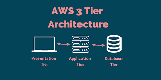

This project demonstrates how to deploy a **secure 3-tier web application architecture on AWS** using a custom **Virtual Private Cloud (VPC)**.

🔒 Secure | ⚙️ Modular | ☁️ AWS-Powered

---

# 🧱 Architecture Diagram

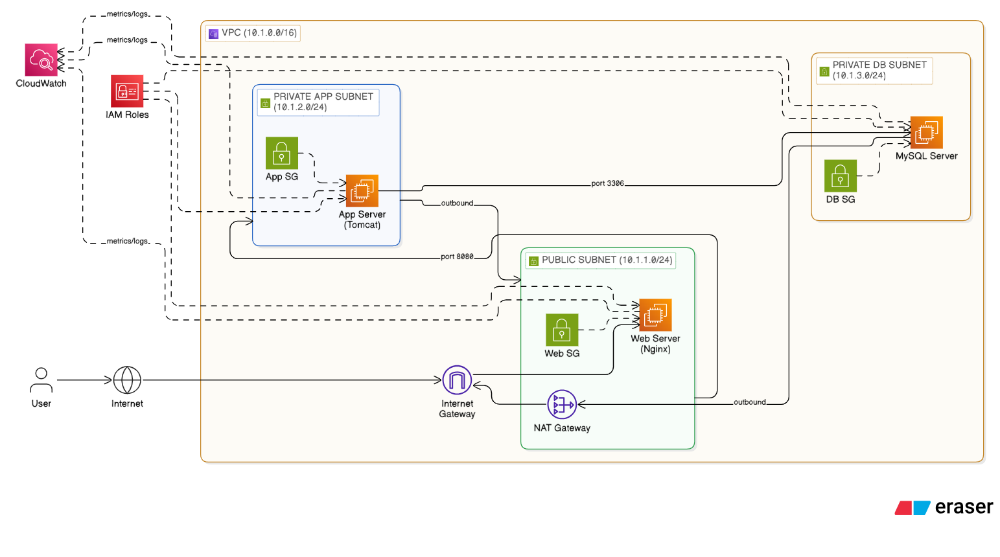

---

# 🛠 Tech Stack

| Layer | Component | AWS Service |
|------|-----------|-------------|
| Web | Nginx | EC2 (Public Subnet) |
| Application | Apache Tomcat | EC2 (Private Subnet) |
| Database | MySQL | EC2 (Private Subnet) |
| Network | VPC | AWS VPC |

---

# 🌐 Step 1: Create VPC

CIDR Block:

```
10.1.0.0/16
```

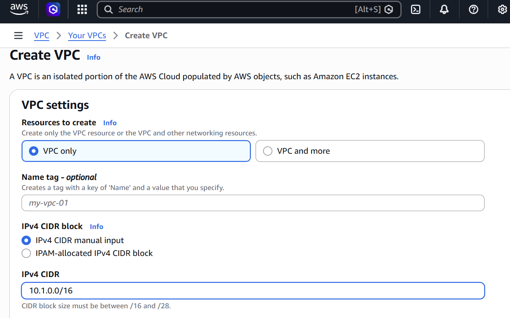

---

# 🌐 Step 2: Create Subnets

| Subnet | CIDR | Purpose |
|------|------|------|
| Public | 10.1.1.0/24 | Web Server |
| Private | 10.1.2.0/24 | App Server |
| Private | 10.1.3.0/24 | Database |

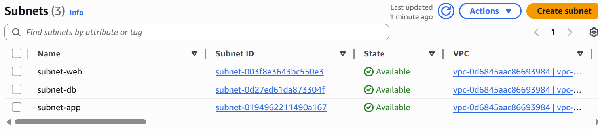

---

# 🌐 Step 3: Configure Internet Gateway

Attach Internet Gateway to the VPC.

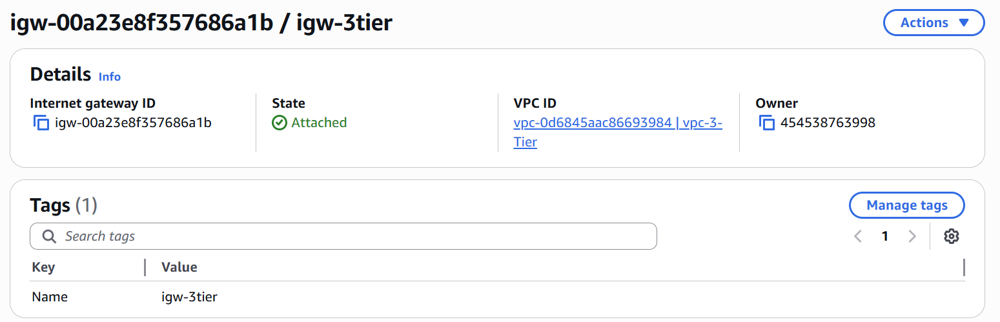

---

# 🌐 Step 4: Configure NAT Gateway

Private instances use NAT Gateway to access the internet securely.

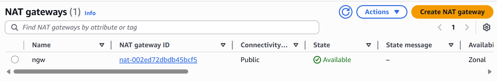

---

# 🌐 Step 5: Configure Route Tables

### Public Route Table

```
0.0.0.0/0 → Internet Gateway
```

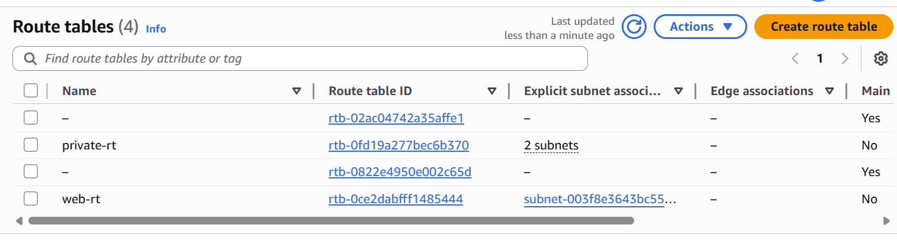

### Private Route Table

```
0.0.0.0/0 → NAT Gateway
```

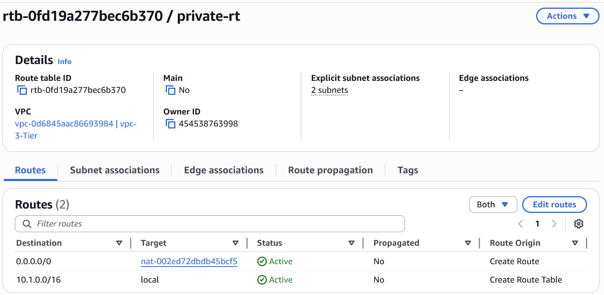

.png)

.png)

---

# 💻 Step 6: Launch EC2 Instances

Three EC2 instances were created:

- Web Server (Nginx)
- App Server (Tomcat)
- Database Server (MySQL)

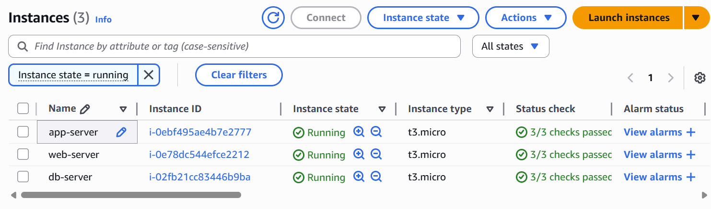

---

# 🌍 Web Tier – Nginx

Install Nginx on the Web EC2 instance.

```bash
sudo apt update
sudo apt install nginx -y
sudo systemctl start nginx
sudo systemctl enable nginx
```

---

# ⚙ Application Tier – Apache Tomcat

Install Java and Apache Tomcat.

```bash
sudo apt update
sudo apt install default-jdk -y
wget https://downloads.apache.org/tomcat/tomcat-11/v11.0.9/bin/apache-tomcat-11.0.9.tar.gz
tar -xvzf apache-tomcat-11.0.9.tar.gz
cd apache-tomcat-11.0.9/bin
./startup.sh
```

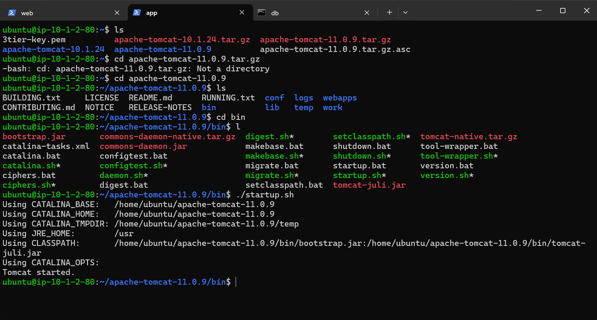

---

# 🛢 Database Tier – MySQL

Install MySQL server.

```bash
sudo apt update
sudo apt install mysql-server -y
sudo systemctl start mysql
sudo systemctl enable mysql
```

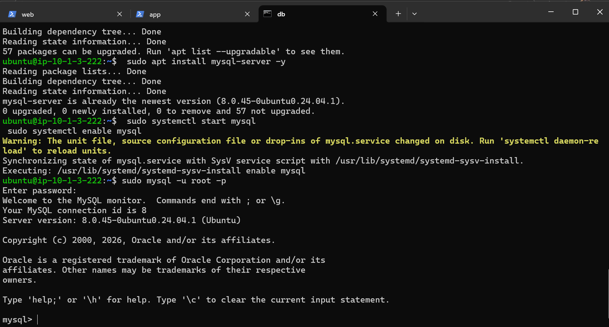

---

# 🔐 MySQL Configuration

Edit the MySQL configuration file:

```bash
sudo vim /etc/mysql/mysql.conf.d/mysqld.cnf
```

Default:

```
bind-address = 127.0.0.1
```

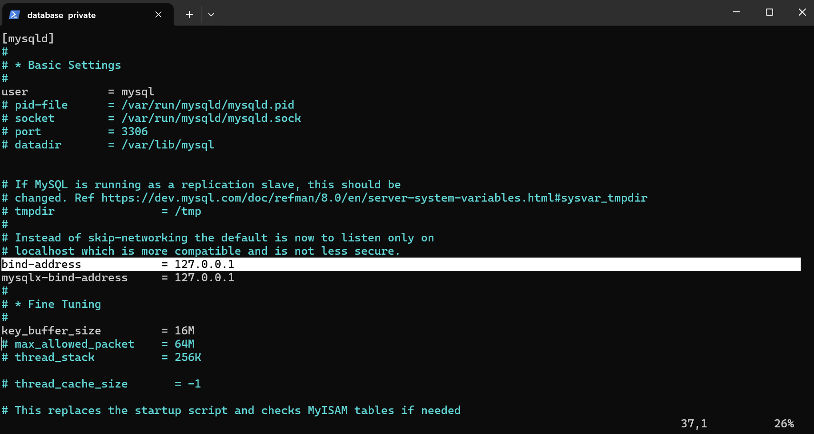

Changed to private IP:

```
bind-address = 10.1.3.x
```

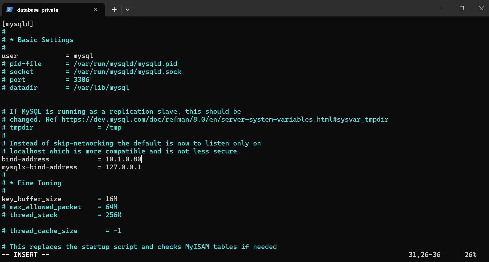

---

# 🔗 Connectivity Testing

Connectivity between instances was verified using:

### Ping

```
ping <private-ip>
```

### Telnet

```
telnet 10.1.2.x 8080
telnet 10.1.3.x 3306
```

---

# 📝 Conclusion

This project demonstrates a **secure and scalable 3-Tier AWS Architecture** using:

- Custom VPC
- Public & Private Subnets
- NAT Gateway
- EC2 instances
- Nginx (Web Layer)
- Tomcat (Application Layer)
- MySQL (Database Layer)

This setup follows **AWS cloud architecture best practices for security and scalability.**

---
